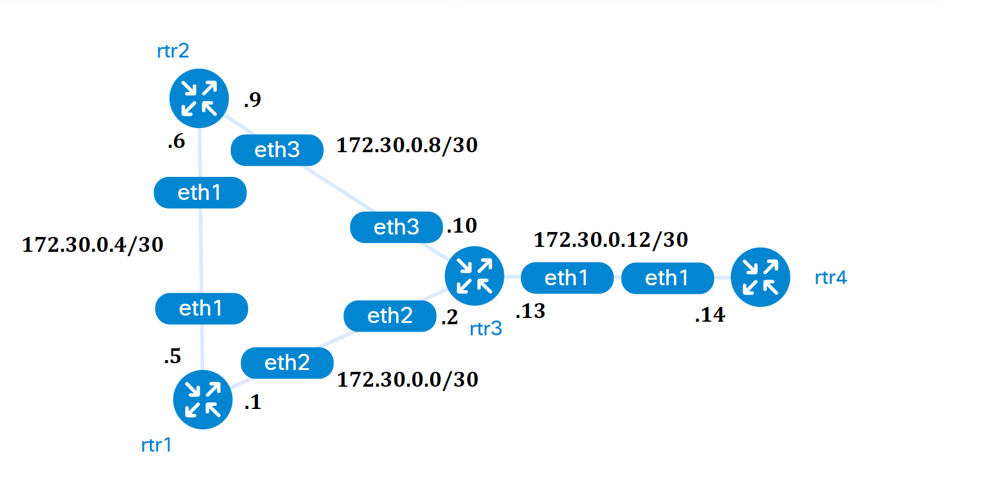

# Preamble

This repository includes a topology definition file for four Cisco CSR1000v running 17.03.04 code which can be launched by Containerlab. In this lab I have preconfigured IP addressing and the EIGRP Routing Protocol to serve as a baseline for experimentation.  I've also included an ansible backup playbook in the directory to allow you to back up your running configuration so they lab may be torn down and rebuilt without the loss of progress.



## Software Requirements

* [Container lab](https://containerlab.dev/install/) version: 0.34.0
* [Docker](https://docs.docker.com/engine/install/) version: 20.10.21, build baeda1f
* [vrnetlab/vr-csr](https://github.com/hellt/vrnetlab/tree/master/csr):17.03.04
* [Ansible](https://docs.ansible.com/ansible/latest/installation_guide/intro_installation.html) version 2.10.8

## System Requirements

* CPU: 3 Cores
* RAM: 12 GB
* DISK: <3GB

## Considerations

You should consider adding the environmental variable "ANSIBLE_HOST_KEY_CHECKING" to False as teardown and recreation of the lab can cause SSH Key Mismatches.

```
export ANSIBLE_HOST_KEY_CHECKING=False
```

## Deploying the lab

This lab can be deployed once all requirements are met by executing the command in the same directory that "eigrp.yaml" exists in.

```
clab deploy -t eigrp.yaml
```

## Accessing the nodes

The default user and admin for the nodes are `admin:admin`. You can access them via ssh and their corresponding DNS name as automatically added in the local "/etc/hosts" file.

```
ssh admin@clab-csr-demo-rtr1
```

## Backing up your progress

You can backup the configuration of your nodes by executing the Ansible Playbook in the same directory that "backup.yaml" exists in.

```
ansible-playbook -i ansible-inventory.yml backup.yaml -u admin -k
```

## Destroying the lab

This lab can be torn down by executing the command in the same directory that "eigrp.yaml" exists in.

```
clab destroy -t eigrp.yaml
```

## Thanks!

If you find this repository interesting please check out [my blog](https://rfc2516.github.io) to see how I'm using this testbed in experimentation and learning!